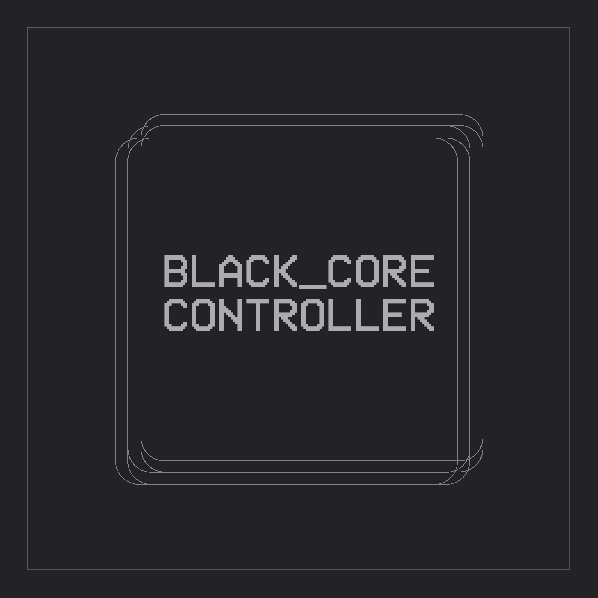

<div align="center">
  
  <h1><code>Black_Core Controller</code></h1>
  
  **Black_Core Controller - Your computer is under full remote control via a regular Telegram bot!**
  
</div>

**Download/Скачать -** [Black_Core Controller_Release 1.0.0](https://github.com/dhaubum/Black-Core-Controller/releases/tag/Black_Core_Controller_Release1.0.0) - [Black_Core Controller_Beta 1.0.0](https://github.com/dhaubum/Black-Core-Controller/releases/tag/Black_Core_Controller_Beta1.0.0)

**Installation and launch instructions -** [link](https://github.com/dhaubum/Black-Core-Controller/blob/ad6226336f39dbd09d300c2bcae11a8f37820e85/Installation%20and%20launch%20instructions-%D0%98%D0%BD%D1%81%D1%82%D1%80%D1%83%D0%BA%D1%86%D0%B8%D1%8F%20%D0%BF%D0%BE%20%D1%83%D1%81%D1%82%D0%B0%D0%BD%D0%BE%D0%B2%D0%BA%D0%B5%20%D0%B8%20%D0%B7%D0%B0%D0%BF%D1%83%D1%81%D0%BA%D1%83.pdf)

<div align="center">

  **WHAT CAN A BOT DO?**
</div>

**Mouse Control**
```
- Moving the cursor
- Left mouse button/The right mouse button/Doubleclick
- Scrolling
```

**KEYBOARD CONTROL**
```
- Text input in any line
- Simulation of pressing any keys and keyboard shortcuts
```

**PROGRAM MANAGEMENT**
```
- Opening programs
- Opening URL links
- Closing of programs
- Getting information about running processes
```

**DEVICE CONTROL**
```
- Screenshot of the screen
- Webcam photos
- Record audio from the microphone
- Volume control
- Turning off the PC
```

**FILES AND FOLDERS**
```
- Browse and navigate through directories
- Deleting files
- Download files to PC
- Download files from PC to Telegram
```

FAQ
-----------
**Q: Where can I get a telegram bot token?**

A: Telegram: Contact [@BotFather](https://t.me/BotFather)

**Q: How do I find out my Chat_ID?**

A: Telegram: Contact [@Get My ID](https://t.me/getmyid_bot)

**Q: Do you have telegram?**

A: Telegram: Contact [@BLACKCORE_CONTROLLER](https://t.me/BLACKCORE_CONTROLLER)

-----------


**You can contribute to the development:**
```
Tonkeeper: UQCMX6uvw4nbd0KFLH1glUwGQKsMVmXzC8l_NH0xzxdC7znK
Bitcoin: bc1qgkwtq5nc43yxgfd7d6w3q2zwh2jdkxz2xw83r2
```
